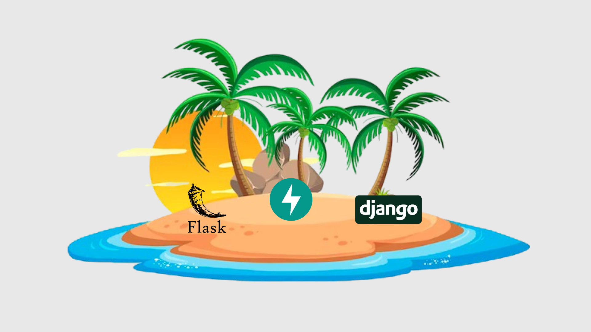
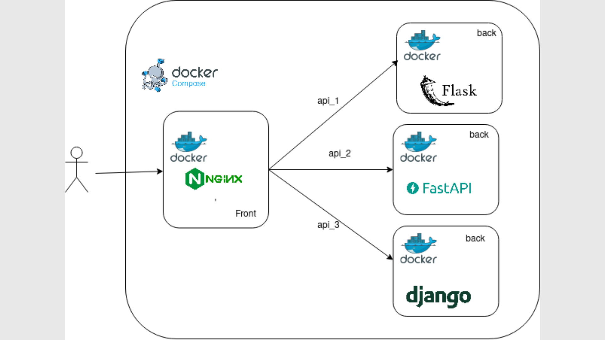

# 74º PUG

## Queimada Grande:Django, Flask e FastAPI pegando fogo na ilha



Antes de Rodar
```
chmod +x ./_/back/flask/wsgi-entrypoint.sh
chmod +x ./_/back/fastapi/wsgi-entrypoint.sh
chmod +x ./_/back/django/wsgi-entrypoint.sh
```

## Rodando

```
docker compose up
```

### Infra:




### Roteiro:

1. Frontend (HTML + Bootstrap): Criação de página de página de card views básica 
2. Frontend (HTML + Bootstrap + JS + Json): Utilização de js para consumir json e popular card views
3. Backend (Flask): Criação de API para consumo de json
4. Backend (FastAPI): Criação de API para consumo de json
5. Backend (Django): Criação de Core do Django
6. Backend (Django): Criação de App Snake para o Django
7. Backend (Django): Criação de API para consumo de json com Django e DFR
8. Documentação: Criação de Readme 

> Para navegar entre os passos, basta trocar de branch, para o step-1, step-2, step-3, etc.


## Author
| <a href="https://github.com/ericxlima"></a> |
| :----: |
| [Eric de Lima](https://github.com/ericxlima) |